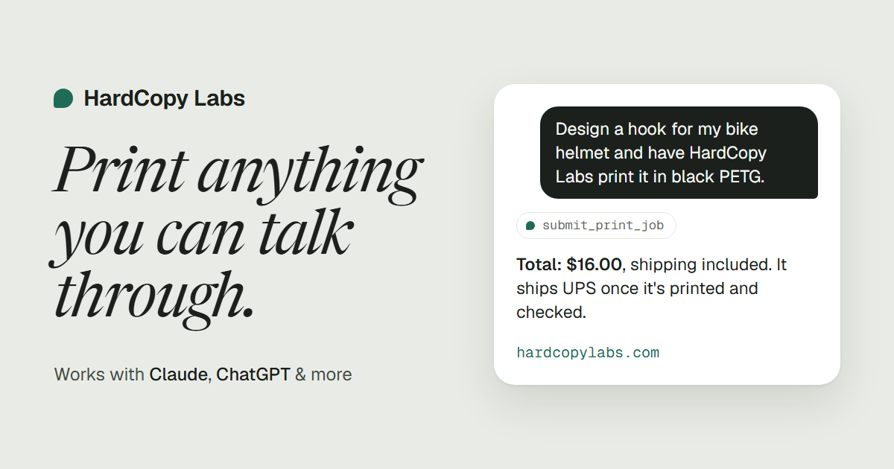

# HardCopy Labs: 3D printing through your AI assistant

[HardCopy Labs](https://hardcopylabs.com) is a small US 3D-print farm you order from inside a
conversation. Connect it to Claude, ChatGPT, or any app that supports remote MCP servers,
then describe a part or hand over an STL. Your assistant checks that it can be printed,
shows you one price with shipping included, and places the order. We inspect every model
by hand, print it in PLA or PETG, and ship it UPS with tracking.

## Connect

**Connector URL:** `https://mcp.hardcopylabs.com/mcp`

Remote MCP server, Streamable HTTP. No account, no API key, no sign-in. Connecting is free;
you only pay when you order a print.

| App | How |
|---|---|
| **Claude** (claude.ai or desktop) | Customize › Connectors › **+** › Add custom connector, then paste the URL. Works on every plan; the Free plan allows one custom connector. |
| **ChatGPT** | Settings › Plugins › Add › Add MCP server. Name `hardcopy-labs`, type HTTP (Streamable HTTP), the URL above, no sign-in. If there's no "Add MCP server" option, turn on Developer mode under Settings › Security and login. |
| **Claude Code** | `claude mcp add --transport http hardcopy https://mcp.hardcopylabs.com/mcp` |
| **Other MCP apps** | Add a remote MCP server by URL over Streamable HTTP. Apps that only run local (stdio) servers can't use it. |

Then try: *"Design a small cable clip and have HardCopy Labs print it."*

Full setup guide: [hardcopylabs.com/#add](https://hardcopylabs.com/#add)

## Try it without a model

`examples/tiny-bug.stl` is a 20 × 20 × 3 mm test part. Download it, attach it in a chat, and
ask: *"Is this printable with HardCopy Labs, and what would it cost?"*

## Tools

| Tool | What it does |
|---|---|
| `validate_stl` | Checks an STL for printability (watertight, fits the build volume), auto-repairs small mesh errors, and returns dimensions and a price estimate. |
| `submit_print_job` | Places an order from an STL or from OpenSCAD source (rendered server-side). Returns a job ID, the total, and a Stripe Checkout link the user pays in their own browser. |
| `check_job_status` | Reports where an order is (review, printing, quality check, shipped) and the UPS tracking number once it ships. |

Your assistant always shows you the price before anything is ordered, and nothing is
printed until you pay through Stripe.

## Specs

- **Materials:** PLA, PETG
- **Max part size:** 305 × 305 × 300 mm
- **Minimum feature:** 2 mm
- **Shipping:** UPS Ground with tracking, United States. Included in the price.
- **Typical prices:** keychain or clip from $14, phone stand about $16, desk organizer about $20

## Links

- Website: [hardcopylabs.com](https://hardcopylabs.com)
- Pricing: [hardcopylabs.com/#pricing](https://hardcopylabs.com/#pricing)
- Terms, shipping, refunds: [hardcopylabs.com/terms](https://hardcopylabs.com/terms)
- Contact: [ben@swinglellc.com](mailto:ben@swinglellc.com)

This repository holds the public listing (`server.json` for the
[official MCP Registry](https://registry.modelcontextprotocol.io)). The server itself is
hosted; there is nothing to install.
